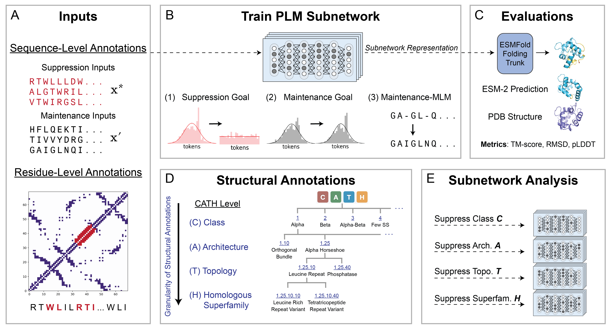

# PLM Inverse Subnetworks

## Description

Protein language models (PLMs) pretrained via a masked language modeling objective have proven effective across a range of structure-related tasks, including high-resolution structure prediction. However, it remains unclear to what extent these models factorize protein structural categories among their learned parameters. In this work, we introduce trainable subnetworks, which mask out PLM weights responsible for the language modeling performance on a structural category of proteins. We systematically train 36 PLM subnetworks targeting both sequence- and residue-level features at varying degrees of resolution using annotations defined by the CATH taxonomy and secondary structure elements. Using these PLM subnetworks, we assess how structural factorization in PLMs influences downstream structure prediction. Our results show that PLMs are highly sensitive to sequence-level features and can predominantly disentangle extremely coarse or fine-grained information. Furthermore, we observe that structure prediction is highly responsive to factorized PLM representations and that small changes in language modeling performance can significantly impair PLM-based structure prediction performance. Our work presents a framework for studying feature entanglement within pretrained PLMs and can be leveraged to improve the alignment of learned PLM representations with known biological patterns.



## Installation
```
git clone https://github.com/microsoft/plm_subnetworks.git
cd plm_subnetworks
pip install -e .
```
## Requirements
For training and MLM evaluations, create the environment:
```
pip install --extra-index-url https://download.pytorch.org/whl/cu121 -r environments/h100env_requirements.txt
source h100env/bin/activate
```
For structure prediction evaluations, create the environment:
```
conda env create -f esmfold_environment.yml
conda activate esmfold
pip install -e .
pip install 'openfold @ git+https://github.com/aqlaboratory/openfold.git@4b41059694619831a7db195b7e0988fc4ff3a307'
```
Note: If installation fails, verify your CUDA version.

## Data

We use the CATH v.4.3.0 release for training. Training data, model checkpoints, ESM-2 650M inference metrics and subnetwork evaluation data to recreate our results in the paper are hosted on Zenodo: [link](https://zenodo.org/uploads/15514844)

Download the files to ```data/``` and results to ```results/```. 

In the above, we provide the PDB chains of the precut CATH domains as used in training, but note that the original data was downloaded at

- Sequences: [cath-dataset-nonredundant-S20-v4_3_0.atom.fa](https://download.cathdb.info/cath/releases/all-releases/v4_3_0/non-redundant-data-sets/cath-dataset-nonredundant-S20-v4_3_0.atom.fa)
- PDB structures: [cath-dataset-nonredundant-S20-v4_3_0.pdb.tgz](https://download.cathdb.info/cath/releases/all-releases/v4_3_0/non-redundant-data-sets/cath-dataset-nonredundant-S20-v4_3_0.pdb.tgz)
- Annotations: [cath-dataset-nonredundant-S40-v4_3_0.list](https://download.cathdb.info/cath/releases/all-releases/v4_3_0/non-redundant-data-sets/cath-dataset-nonredundant-S40-v4_3_0.list)

Annotation format: [CATH README](https://github.com/wukevin/proteinclip/blob/main/data/cath/README-cath-list-file-format.txt)

CATH entries are processed as objects, which can be inspected via

```
python plm_subnetworks/dataset/cath_dataset.py 1a1rA02

CATHEntry
cath_id: 1a1rA02
boundary: 121-205
pdb: 1a1r
chain_num: A
domain_num: 2
class_num: 2
architecture: 40
topology: 10
homologous_superfamily: 10
s35: 66
s60: 1
s95: 5
s100: 4
s100_count: 1
domain_length: 85
resolution: 2.5
sequence: TPCTCGSSDLYLVTRHADVIPVRRRGDSRGSLLSPRPISYLKGSSGGPLLCPTGHAVGLFRAAVCTRGVAKAVDFIPVENLETTM

```
Model checkpoints are stored in split zip files, you can reassemble them via 
```
cat checkpoints.tar.gz.part_* > checkpoints.tar.gz
tar -xvzf checkpoints.tar.gz
```


## Training subnetworks

You can train a sequence-suppression model via
```
python plm_subnetworks/subnetwork/train_logits.py \
    --run_name seq-suppression-class-1 \
    --wandb_project cath-class \
    --batch_size 16 \
    --max_epochs 1000 \
    --mask_init_value 0.96 \
    --suppression_mode cath \
    --suppression_level class \
    --suppression_target 1 \
    --num_examples_per_batch 4 \
    --learning_rate 1e-1 \
    --precision bf16 \
    --maintenance_lambda 7 \
    --suppression_lambda 10 \
    --maintenance_mlm_lambda 1 \
    --num_workers 4 \
    --accumulate_grad_batches 4 \
    --mask_top_layer_frac 0.8 \
    --sparsity_warmup_epochs 200 \
    --mask_temp_init 3.2 \
    --mask_temp_final 0.01 \
    --mask_temp_decay 100 \
    --lr_phaseA 1e-1 \
    --lr_phaseB 5e-4 \
    --lr_plateau_epochs 125 \
    --lr_hold_epochs 50 \
    --mask_threshold 0.40 \
    --ckpt_freq 5 \
    --sparsity_ramp_epochs 150 
```


To run residue-level suppression, set:
- `--suppression_mode dssp`
- `--suppression_target helix|strand|coil`

Additional notes:
- `--num_examples_per_batch` adjusts suppression/maintenance examples ratio in a batch.
- Use `--random_n` with `--suppression_level random` for a random baseline.
- In our results we set ```--mask_top_layer_frac``` for all subnetworks to 0.8, which means mask the top 80% of transformer layers, but you can also choose to mask specific layer ranges with ```--layers_to_mask```.
- Runs are saved in `runs/<run_name>`.


## Evaluating subnetworks

### MLM evaluation
- To run inference with a trained subnetwork, specify the run name, epoch to evaluate, category and suppression target. 
- ```n_passes``` can be used to specify how many inference passes to run (in our paper we use 10). 
- ```--extend_val``` performs evaluation on the full dataset, the absence of this flag results in inference only on the validation data for each model. 
- You can pass ```--csv``` with the path to a csv of subnetworks metadata to evaluate a set of models, such that you don't have to specify individual settings. See ```results/metadata.csv``` for an example.

```
python evaluation/plm_seq_inference.py \
    --run_name seq-suppression-class-1_11552001 \
    --epoch 02 \
    --category cath_class_code \
    --target 1 \
    --n_passes 10 \
    --extend_val
```

### Folding and structure prediction evaluation
Note that this evaluation requires the provided esmfold environment to be activated.

```
python evaluation/fold_sequences.py \
    --run_name seq-suppression-class-1_11552001 \
    --epoch 02 \
    --category cath_class_code 
```
Specify ```--cath_ids``` to only fold specific examples.


To run TMAlign on predicted structures,

```
python evaluation/tm_scores.py \
    --run_name seq-suppression-class-1_11552001 \
    --mode pred \
    --epoch 02 \
    --category cath_class_code \
    --target 1 \
    --subnetwork_eval 
```
- ```--subnetwork_eval``` is required to evaluate an subnetwork. 
- You can evaluate specific examples by specifying ```--cath_ids``` as in the above.
- The default script assumes that TMAlign installed in your path via ```TMAlign/``` but you can specify it with the ```--tm_align_path``` argument. If you don't have TMAlign installed, install it from [here](https://anaconda.org/bioconda/tmalign$0).

## Recreating results from the paper

For ease, we provided the results of ESM-2 650M perplexities and ESMFold (650M) on our dataset. For each trained subnetwork reported in our paper, we provide the following in ```results/```:
- config used to train model
- train val split
- model checkpoint
- 10 runs of per-sequence perplexity on the full dataset
- per-predicted structure TM-score, RMSD, pLDDT
- For the models compared in Figures 3D-G in the paper, we also provide the predicted structures.

We provide code to reproduce all figures from the paper with these results in ```notebooks/```. This code can be modified to visualize the results of any newly trained subnetworks. 

## Extending to new datasets and annotations

- All sequences and annotations are extracted for a fasta file format. You can add new modules to parse fasta headers with different annotations. See ```plm_subnetworks/dataset/swissprot_dataset.py``` for an example of parsing the SwissProt dataset and annotations.
- We provide utilities to extract DSSP secondary structure annotations in ```plm_subnetworks/dssp/```.

## Contact
For questions or issues, please contact [Ria Vinod](mailto:ria_vinod@brown.edu), [Lorin Crawford](mailto:lcrawford@microsoft.com), or [Kevin Yang](mailto:Yang.Kevin@microsoft.com).

## Citation (BibTeX)
If you use this code or method in your research, please consider citing the following:

```
@article {token,
	author = {Vinod, Ria and Amini, Ava P. and Crawford, Lorin and Yang, Kevin K.},
	title = {Trainable inverse subnetworks reveal insights into structure knowledge organization in protein language models},
	elocation-id = {},
	year = {2025},
	doi = {},
	publisher = {Cold Spring Harbor Laboratory},
	URL = {},
	eprint = {},
	journal = {bioRxiv}
}
```
## License

This project is available under the MIT License.

## Contributing

This project welcomes contributions and suggestions.  Most contributions require you to agree to a
Contributor License Agreement (CLA) declaring that you have the right to, and actually do, grant us
the rights to use your contribution. For details, visit https://cla.opensource.microsoft.com.

When you submit a pull request, a CLA bot will automatically determine whether you need to provide
a CLA and decorate the PR appropriately (e.g., status check, comment). Simply follow the instructions
provided by the bot. You will only need to do this once across all repos using our CLA.

This project has adopted the [Microsoft Open Source Code of Conduct](https://opensource.microsoft.com/codeofconduct/).
For more information see the [Code of Conduct FAQ](https://opensource.microsoft.com/codeofconduct/faq/) or
contact [opencode@microsoft.com](mailto:opencode@microsoft.com) with any additional questions or comments.

## Trademarks

This project may contain trademarks or logos for projects, products, or services. Authorized use of Microsoft 
trademarks or logos is subject to and must follow 
[Microsoft's Trademark & Brand Guidelines](https://www.microsoft.com/en-us/legal/intellectualproperty/trademarks/usage/general).
Use of Microsoft trademarks or logos in modified versions of this project must not cause confusion or imply Microsoft sponsorship.
Any use of third-party trademarks or logos are subject to those third-party's policies.
